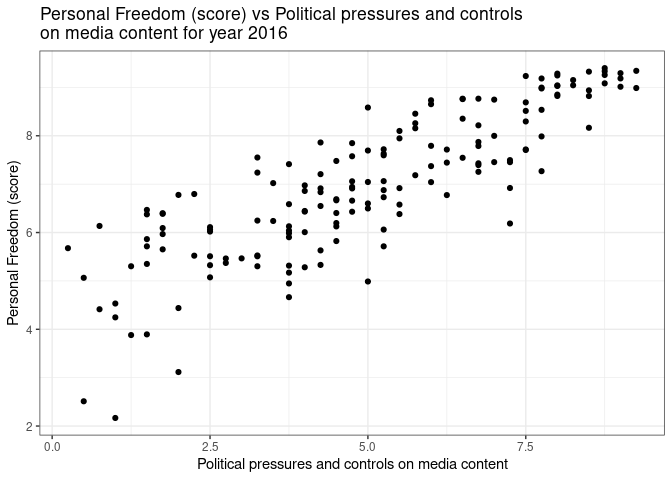
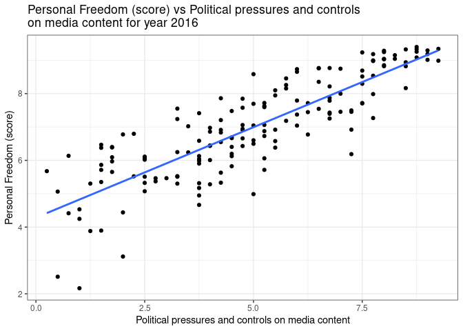
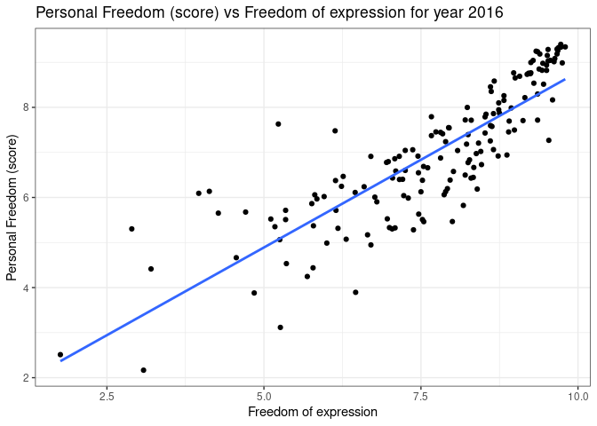
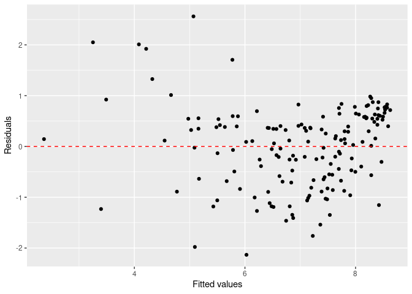
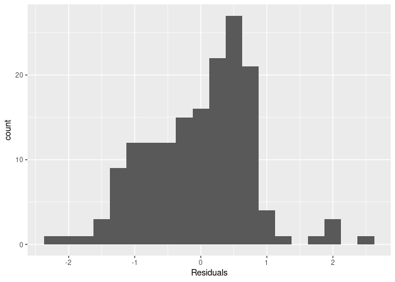
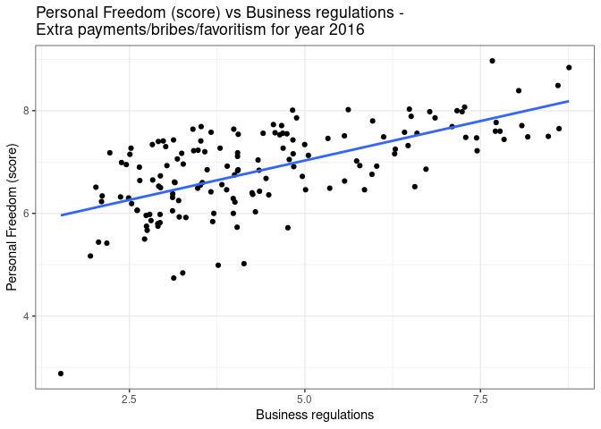

Activity 2
================

# Day 1

## Task 3: Load the data and

``` r
hfi <- read_csv("https://www.openintro.org/data/csv/hfi.csv");
```

    ## Rows: 1458 Columns: 123
    ## ── Column specification ────────────────────────────────────────────────────────
    ## Delimiter: ","
    ## chr   (3): ISO_code, countries, region
    ## dbl (120): year, pf_rol_procedural, pf_rol_civil, pf_rol_criminal, pf_rol, p...
    ## 
    ## ℹ Use `spec()` to retrieve the full column specification for this data.
    ## ℹ Specify the column types or set `show_col_types = FALSE` to quiet this message.

``` r
glimpse(hfi)
```

    ## Rows: 1,458
    ## Columns: 123
    ## $ year                               <dbl> 2016, 2016, 2016, 2016, 2016, 2016,…
    ## $ ISO_code                           <chr> "ALB", "DZA", "AGO", "ARG", "ARM", …
    ## $ countries                          <chr> "Albania", "Algeria", "Angola", "Ar…
    ## $ region                             <chr> "Eastern Europe", "Middle East & No…
    ## $ pf_rol_procedural                  <dbl> 6.661503, NA, NA, 7.098483, NA, 8.4…
    ## $ pf_rol_civil                       <dbl> 4.547244, NA, NA, 5.791960, NA, 7.5…
    ## $ pf_rol_criminal                    <dbl> 4.666508, NA, NA, 4.343930, NA, 7.3…
    ## $ pf_rol                             <dbl> 5.291752, 3.819566, 3.451814, 5.744…
    ## $ pf_ss_homicide                     <dbl> 8.920429, 9.456254, 8.060260, 7.622…
    ## $ pf_ss_disappearances_disap         <dbl> 10, 10, 5, 10, 10, 10, 10, 10, 10, …
    ## $ pf_ss_disappearances_violent       <dbl> 10.000000, 9.294030, 10.000000, 10.…
    ## $ pf_ss_disappearances_organized     <dbl> 10.0, 5.0, 7.5, 7.5, 7.5, 10.0, 10.…
    ## $ pf_ss_disappearances_fatalities    <dbl> 10.000000, 9.926119, 10.000000, 10.…
    ## $ pf_ss_disappearances_injuries      <dbl> 10.000000, 9.990149, 10.000000, 9.9…
    ## $ pf_ss_disappearances               <dbl> 10.000000, 8.842060, 8.500000, 9.49…
    ## $ pf_ss_women_fgm                    <dbl> 10.0, 10.0, 10.0, 10.0, 10.0, 10.0,…
    ## $ pf_ss_women_missing                <dbl> 7.5, 7.5, 10.0, 10.0, 5.0, 10.0, 10…
    ## $ pf_ss_women_inheritance_widows     <dbl> 5, 0, 5, 10, 10, 10, 10, 5, NA, 0, …
    ## $ pf_ss_women_inheritance_daughters  <dbl> 5, 0, 5, 10, 10, 10, 10, 10, NA, 0,…
    ## $ pf_ss_women_inheritance            <dbl> 5.0, 0.0, 5.0, 10.0, 10.0, 10.0, 10…
    ## $ pf_ss_women                        <dbl> 7.500000, 5.833333, 8.333333, 10.00…
    ## $ pf_ss                              <dbl> 8.806810, 8.043882, 8.297865, 9.040…
    ## $ pf_movement_domestic               <dbl> 5, 5, 0, 10, 5, 10, 10, 5, 10, 10, …
    ## $ pf_movement_foreign                <dbl> 10, 5, 5, 10, 5, 10, 10, 5, 10, 5, …
    ## $ pf_movement_women                  <dbl> 5, 5, 10, 10, 10, 10, 10, 5, NA, 5,…
    ## $ pf_movement                        <dbl> 6.666667, 5.000000, 5.000000, 10.00…
    ## $ pf_religion_estop_establish        <dbl> NA, NA, NA, NA, NA, NA, NA, NA, NA,…
    ## $ pf_religion_estop_operate          <dbl> NA, NA, NA, NA, NA, NA, NA, NA, NA,…
    ## $ pf_religion_estop                  <dbl> 10.0, 5.0, 10.0, 7.5, 5.0, 10.0, 10…
    ## $ pf_religion_harassment             <dbl> 9.566667, 6.873333, 8.904444, 9.037…
    ## $ pf_religion_restrictions           <dbl> 8.011111, 2.961111, 7.455556, 6.850…
    ## $ pf_religion                        <dbl> 9.192593, 4.944815, 8.786667, 7.795…
    ## $ pf_association_association         <dbl> 10.0, 5.0, 2.5, 7.5, 7.5, 10.0, 10.…
    ## $ pf_association_assembly            <dbl> 10.0, 5.0, 2.5, 10.0, 7.5, 10.0, 10…
    ## $ pf_association_political_establish <dbl> NA, NA, NA, NA, NA, NA, NA, NA, NA,…
    ## $ pf_association_political_operate   <dbl> NA, NA, NA, NA, NA, NA, NA, NA, NA,…
    ## $ pf_association_political           <dbl> 10.0, 5.0, 2.5, 5.0, 5.0, 10.0, 10.…
    ## $ pf_association_prof_establish      <dbl> NA, NA, NA, NA, NA, NA, NA, NA, NA,…
    ## $ pf_association_prof_operate        <dbl> NA, NA, NA, NA, NA, NA, NA, NA, NA,…
    ## $ pf_association_prof                <dbl> 10.0, 5.0, 5.0, 7.5, 5.0, 10.0, 10.…
    ## $ pf_association_sport_establish     <dbl> NA, NA, NA, NA, NA, NA, NA, NA, NA,…
    ## $ pf_association_sport_operate       <dbl> NA, NA, NA, NA, NA, NA, NA, NA, NA,…
    ## $ pf_association_sport               <dbl> 10.0, 5.0, 7.5, 7.5, 7.5, 10.0, 10.…
    ## $ pf_association                     <dbl> 10.0, 5.0, 4.0, 7.5, 6.5, 10.0, 10.…
    ## $ pf_expression_killed               <dbl> 10.000000, 10.000000, 10.000000, 10…
    ## $ pf_expression_jailed               <dbl> 10.000000, 10.000000, 10.000000, 10…
    ## $ pf_expression_influence            <dbl> 5.0000000, 2.6666667, 2.6666667, 5.…
    ## $ pf_expression_control              <dbl> 5.25, 4.00, 2.50, 5.50, 4.25, 7.75,…
    ## $ pf_expression_cable                <dbl> 10.0, 10.0, 7.5, 10.0, 7.5, 10.0, 1…
    ## $ pf_expression_newspapers           <dbl> 10.0, 7.5, 5.0, 10.0, 7.5, 10.0, 10…
    ## $ pf_expression_internet             <dbl> 10.0, 7.5, 7.5, 10.0, 7.5, 10.0, 10…
    ## $ pf_expression                      <dbl> 8.607143, 7.380952, 6.452381, 8.738…
    ## $ pf_identity_legal                  <dbl> 0, NA, 10, 10, 7, 7, 10, 0, NA, NA,…
    ## $ pf_identity_parental_marriage      <dbl> 10, 0, 10, 10, 10, 10, 10, 10, 10, …
    ## $ pf_identity_parental_divorce       <dbl> 10, 5, 10, 10, 10, 10, 10, 10, 10, …
    ## $ pf_identity_parental               <dbl> 10.0, 2.5, 10.0, 10.0, 10.0, 10.0, …
    ## $ pf_identity_sex_male               <dbl> 10, 0, 0, 10, 10, 10, 10, 10, 10, 1…
    ## $ pf_identity_sex_female             <dbl> 10, 0, 0, 10, 10, 10, 10, 10, 10, 1…
    ## $ pf_identity_sex                    <dbl> 10, 0, 0, 10, 10, 10, 10, 10, 10, 1…
    ## $ pf_identity_divorce                <dbl> 5, 0, 10, 10, 5, 10, 10, 5, NA, 0, …
    ## $ pf_identity                        <dbl> 6.2500000, 0.8333333, 7.5000000, 10…
    ## $ pf_score                           <dbl> 7.596281, 5.281772, 6.111324, 8.099…
    ## $ pf_rank                            <dbl> 57, 147, 117, 42, 84, 11, 8, 131, 6…
    ## $ ef_government_consumption          <dbl> 8.232353, 2.150000, 7.600000, 5.335…
    ## $ ef_government_transfers            <dbl> 7.509902, 7.817129, 8.886739, 6.048…
    ## $ ef_government_enterprises          <dbl> 8, 0, 0, 6, 8, 10, 10, 0, 7, 10, 7,…
    ## $ ef_government_tax_income           <dbl> 9, 7, 10, 7, 5, 5, 4, 9, 10, 10, 8,…
    ## $ ef_government_tax_payroll          <dbl> 7, 2, 9, 1, 5, 5, 3, 4, 10, 10, 8, …
    ## $ ef_government_tax                  <dbl> 8.0, 4.5, 9.5, 4.0, 5.0, 5.0, 3.5, …
    ## $ ef_government                      <dbl> 7.935564, 3.616782, 6.496685, 5.346…
    ## $ ef_legal_judicial                  <dbl> 2.6682218, 4.1867042, 1.8431292, 3.…
    ## $ ef_legal_courts                    <dbl> 3.145462, 4.327113, 1.974566, 2.930…
    ## $ ef_legal_protection                <dbl> 4.512228, 4.689952, 2.512364, 4.255…
    ## $ ef_legal_military                  <dbl> 8.333333, 4.166667, 3.333333, 7.500…
    ## $ ef_legal_integrity                 <dbl> 4.166667, 5.000000, 4.166667, 3.333…
    ## $ ef_legal_enforcement               <dbl> 4.3874441, 4.5075380, 2.3022004, 3.…
    ## $ ef_legal_restrictions              <dbl> 6.485287, 6.626692, 5.455882, 6.857…
    ## $ ef_legal_police                    <dbl> 6.933500, 6.136845, 3.016104, 3.385…
    ## $ ef_legal_crime                     <dbl> 6.215401, 6.737383, 4.291197, 4.133…
    ## $ ef_legal_gender                    <dbl> 0.9487179, 0.8205128, 0.8461538, 0.…
    ## $ ef_legal                           <dbl> 5.071814, 4.690743, 2.963635, 3.904…
    ## $ ef_money_growth                    <dbl> 8.986454, 6.955962, 9.385679, 5.233…
    ## $ ef_money_sd                        <dbl> 9.484575, 8.339152, 4.986742, 5.224…
    ## $ ef_money_inflation                 <dbl> 9.743600, 8.720460, 3.054000, 2.000…
    ## $ ef_money_currency                  <dbl> 10, 5, 5, 10, 10, 10, 10, 5, 0, 10,…
    ## $ ef_money                           <dbl> 9.553657, 7.253894, 5.606605, 5.614…
    ## $ ef_trade_tariffs_revenue           <dbl> 9.626667, 8.480000, 8.993333, 6.060…
    ## $ ef_trade_tariffs_mean              <dbl> 9.24, 6.22, 7.72, 7.26, 8.76, 9.50,…
    ## $ ef_trade_tariffs_sd                <dbl> 8.0240, 5.9176, 4.2544, 5.9448, 8.0…
    ## $ ef_trade_tariffs                   <dbl> 8.963556, 6.872533, 6.989244, 6.421…
    ## $ ef_trade_regulatory_nontariff      <dbl> 5.574481, 4.962589, 3.132738, 4.466…
    ## $ ef_trade_regulatory_compliance     <dbl> 9.4053278, 0.0000000, 0.9171598, 5.…
    ## $ ef_trade_regulatory                <dbl> 7.489905, 2.481294, 2.024949, 4.811…
    ## $ ef_trade_black                     <dbl> 10.00000, 5.56391, 10.00000, 0.0000…
    ## $ ef_trade_movement_foreign          <dbl> 6.306106, 3.664829, 2.946919, 5.358…
    ## $ ef_trade_movement_capital          <dbl> 4.6153846, 0.0000000, 3.0769231, 0.…
    ## $ ef_trade_movement_visit            <dbl> 8.2969231, 1.1062564, 0.1106256, 7.…
    ## $ ef_trade_movement                  <dbl> 6.406138, 1.590362, 2.044823, 4.697…
    ## $ ef_trade                           <dbl> 8.214900, 4.127025, 5.264754, 3.982…
    ## $ ef_regulation_credit_ownership     <dbl> 5, 0, 8, 5, 10, 10, 8, 5, 10, 10, 5…
    ## $ ef_regulation_credit_private       <dbl> 7.295687, 5.301526, 9.194715, 4.259…
    ## $ ef_regulation_credit_interest      <dbl> 9, 10, 4, 7, 10, 10, 10, 9, 10, 10,…
    ## $ ef_regulation_credit               <dbl> 7.098562, 5.100509, 7.064905, 5.419…
    ## $ ef_regulation_labor_minwage        <dbl> 5.566667, 5.566667, 8.900000, 2.766…
    ## $ ef_regulation_labor_firing         <dbl> 5.396399, 3.896912, 2.656198, 2.191…
    ## $ ef_regulation_labor_bargain        <dbl> 6.234861, 5.958321, 5.172987, 3.432…
    ## $ ef_regulation_labor_hours          <dbl> 8, 6, 4, 10, 10, 10, 6, 6, 8, 8, 10…
    ## $ ef_regulation_labor_dismissal      <dbl> 6.299741, 7.755176, 6.632764, 2.517…
    ## $ ef_regulation_labor_conscription   <dbl> 10, 1, 0, 10, 0, 10, 3, 1, 10, 10, …
    ## $ ef_regulation_labor                <dbl> 6.916278, 5.029513, 4.560325, 5.151…
    ## $ ef_regulation_business_adm         <dbl> 6.072172, 3.722341, 2.758428, 2.404…
    ## $ ef_regulation_business_bureaucracy <dbl> 6.000000, 1.777778, 1.333333, 6.666…
    ## $ ef_regulation_business_start       <dbl> 9.713864, 9.243070, 8.664627, 9.122…
    ## $ ef_regulation_business_bribes      <dbl> 4.050196, 3.765515, 1.945540, 3.260…
    ## $ ef_regulation_business_licensing   <dbl> 7.324582, 8.523503, 8.096776, 5.253…
    ## $ ef_regulation_business_compliance  <dbl> 7.074366, 7.029528, 6.782923, 6.508…
    ## $ ef_regulation_business             <dbl> 6.705863, 5.676956, 4.930271, 5.535…
    ## $ ef_regulation                      <dbl> 6.906901, 5.268992, 5.518500, 5.369…
    ## $ ef_score                           <dbl> 7.54, 4.99, 5.17, 4.84, 7.57, 7.98,…
    ## $ ef_rank                            <dbl> 34, 159, 155, 160, 29, 10, 27, 106,…
    ## $ hf_score                           <dbl> 7.568140, 5.135886, 5.640662, 6.469…
    ## $ hf_rank                            <dbl> 48, 155, 142, 107, 57, 4, 16, 130, …
    ## $ hf_quartile                        <dbl> 2, 4, 4, 3, 2, 1, 1, 4, 2, 2, 4, 2,…

``` r
head(hfi)
```

    ## # A tibble: 6 × 123
    ##    year ISO_code countries region pf_ro…¹ pf_ro…² pf_ro…³ pf_rol pf_ss…⁴ pf_ss…⁵
    ##   <dbl> <chr>    <chr>     <chr>    <dbl>   <dbl>   <dbl>  <dbl>   <dbl>   <dbl>
    ## 1  2016 ALB      Albania   Easte…    6.66    4.55    4.67   5.29    8.92      10
    ## 2  2016 DZA      Algeria   Middl…   NA      NA      NA      3.82    9.46      10
    ## 3  2016 AGO      Angola    Sub-S…   NA      NA      NA      3.45    8.06       5
    ## 4  2016 ARG      Argentina Latin…    7.10    5.79    4.34   5.74    7.62      10
    ## 5  2016 ARM      Armenia   Cauca…   NA      NA      NA      5.00    8.81      10
    ## 6  2016 AUS      Australia Ocean…    8.44    7.53    7.36   7.78    9.62      10
    ## # … with 113 more variables: pf_ss_disappearances_violent <dbl>,
    ## #   pf_ss_disappearances_organized <dbl>,
    ## #   pf_ss_disappearances_fatalities <dbl>, pf_ss_disappearances_injuries <dbl>,
    ## #   pf_ss_disappearances <dbl>, pf_ss_women_fgm <dbl>,
    ## #   pf_ss_women_missing <dbl>, pf_ss_women_inheritance_widows <dbl>,
    ## #   pf_ss_women_inheritance_daughters <dbl>, pf_ss_women_inheritance <dbl>,
    ## #   pf_ss_women <dbl>, pf_ss <dbl>, pf_movement_domestic <dbl>, …

### Dataset

There are 123 columns/variables and 1458 observations.

Each row in the dataset gives the freedom score, rank, quantile and
other scores for a single country for a year.

### Filtering for only 2016

``` r
hfi_2016 <- hfi %>% filter(year == 2016)
head(hfi_2016)
```

    ## # A tibble: 6 × 123
    ##    year ISO_code countries region pf_ro…¹ pf_ro…² pf_ro…³ pf_rol pf_ss…⁴ pf_ss…⁵
    ##   <dbl> <chr>    <chr>     <chr>    <dbl>   <dbl>   <dbl>  <dbl>   <dbl>   <dbl>
    ## 1  2016 ALB      Albania   Easte…    6.66    4.55    4.67   5.29    8.92      10
    ## 2  2016 DZA      Algeria   Middl…   NA      NA      NA      3.82    9.46      10
    ## 3  2016 AGO      Angola    Sub-S…   NA      NA      NA      3.45    8.06       5
    ## 4  2016 ARG      Argentina Latin…    7.10    5.79    4.34   5.74    7.62      10
    ## 5  2016 ARM      Armenia   Cauca…   NA      NA      NA      5.00    8.81      10
    ## 6  2016 AUS      Australia Ocean…    8.44    7.53    7.36   7.78    9.62      10
    ## # … with 113 more variables: pf_ss_disappearances_violent <dbl>,
    ## #   pf_ss_disappearances_organized <dbl>,
    ## #   pf_ss_disappearances_fatalities <dbl>, pf_ss_disappearances_injuries <dbl>,
    ## #   pf_ss_disappearances <dbl>, pf_ss_women_fgm <dbl>,
    ## #   pf_ss_women_missing <dbl>, pf_ss_women_inheritance_widows <dbl>,
    ## #   pf_ss_women_inheritance_daughters <dbl>, pf_ss_women_inheritance <dbl>,
    ## #   pf_ss_women <dbl>, pf_ss <dbl>, pf_movement_domestic <dbl>, …

### Plot

``` r
hfi_2016 %>% ggplot(aes(pf_expression_control, pf_score)) +
  geom_point() +
  labs(
    title = "Personal Freedom (score) vs Political pressures and controls \non media content for year 2016",
    x = "Political pressures and controls on media content",
    y = "Personal Freedom (score)"
  )+
  theme_bw()
```

<!-- -->

The relationship looks linear with a positive slope. A linear model
seems to be a good choice here.

## Task 4: Sum of squared residuals

The manual process gave me a minimum sum of squares of 106.83 for line
pf\_score = 4.1750 + 0.5302 \* pf\_expression\_control.

## Task 5: The linear model

``` r
m1 <- lm(pf_score ~ pf_expression_control, data = hfi_2016)
tidy(m1)
```

    ## # A tibble: 2 × 5
    ##   term                  estimate std.error statistic  p.value
    ##   <chr>                    <dbl>     <dbl>     <dbl>    <dbl>
    ## 1 (Intercept)              4.28     0.149       28.8 4.23e-65
    ## 2 pf_expression_control    0.542    0.0271      20.0 2.31e-45

Here the y-intercept is: 4.2838153 and the slope is: 0.5418452.

# Day 2

## Task 2: Overall model fit

### Correlation

``` r
cor(hfi_2016$pf_score, hfi_2016$pf_expression_control)
```

    ## [1] 0.8450646

This means that pf\_score and pf\_expression\_control have high positive
correlation. That means if pf\_expression\_control increases pf\_score
also increases and we can use pf\_expression\_control to predict
pf\_score.

### R<sup>2</sup> of the model

``` r
glance(m1)
```

    ## # A tibble: 1 × 12
    ##   r.squared adj.r.squa…¹ sigma stati…²  p.value    df logLik   AIC   BIC devia…³
    ##       <dbl>        <dbl> <dbl>   <dbl>    <dbl> <dbl>  <dbl> <dbl> <dbl>   <dbl>
    ## 1     0.714        0.712 0.799    400. 2.31e-45     1  -193.  391.  400.    102.
    ## # … with 2 more variables: df.residual <int>, nobs <int>, and abbreviated
    ## #   variable names ¹​adj.r.squared, ²​statistic, ³​deviance

The R<sup>2</sup> of the model is 0.7141342.

This means that 71.41% of the variability in pf\_score is explained away
by this model.

### Predicting Human freedom score based on Political pressures and controls on media content

``` r
m2 <- lm(hf_score ~ pf_expression_control, data = hfi_2016)
tidy(m2)
```

    ## # A tibble: 2 × 5
    ##   term                  estimate std.error statistic  p.value
    ##   <chr>                    <dbl>     <dbl>     <dbl>    <dbl>
    ## 1 (Intercept)              5.05     0.123       41.1 5.97e-87
    ## 2 pf_expression_control    0.368    0.0224      16.5 2.73e-36

When no Political Pressure and Control is exerted on the media content,
the mean Human freedom score estimate is 5.053396.

For unit increase in Political pressure and control the increase in mean
Human freedom score is estimated to be 0.368432.

Political pressure and control on the media content and the Human
freedom score have a positive relationship.

## Task 3: Prediction and prediction errors

### Plot

``` r
hfi_2016 %>% ggplot(aes(pf_expression_control, pf_score)) +
  geom_point() +
  geom_smooth(method = "lm", se = FALSE) +
  labs(
    title = "Personal Freedom (score) vs Political pressures and controls \non media content for year 2016",
    x = "Political pressures and controls on media content",
    y = "Personal Freedom (score)"
  )+
  theme_bw()
```

    ## `geom_smooth()` using formula 'y ~ x'

<!-- -->

From just the plot, to get Personal Freedom score for 3 rating for
pf\_expression\_control, we can follow the vertical line at 3 on the
x-axis until we get to the lm line. It gives approximately 6.3 for
pf\_score.

This is actually an overestimate becuase most of the points in the data
is below the line.

## Task 4: Model diagnostics

### Residual Plot

``` r
m1_aug <- augment(m1)

ggplot(data = m1_aug, aes(x = .fitted, y = .resid)) +
  geom_point() +
  geom_hline(yintercept = 0, linetype = "dashed", color = "red") +
  xlab("Fitted values") +
  ylab("Residuals")
```

<!-- -->

The residuals have a random spread from left to right with most points
within 1 to -1. The residuals are also closer to 0. This means that
pf\_expression\_control is a good predictor of pf\_score.

### Residuals Histogram

``` r
ggplot(data = m1_aug, aes(x = .resid)) +
  geom_histogram(binwidth = 0.25) +
  xlab("Residuals")
```

<!-- -->

The histogram of the residuals is unimodal and skewed left. This raises
questions about the normality of the data.

Looking at the residual vs fitted plot it appears that the constant
variability assumption is met since there are no apparent pattern
visible.

## Challenge: More practice

I choose *pf\_expression* which is a score of Freedom of expression to
predict *pf\_score*. I chose *pf\_expression* because freedom of
expression is important for personal freedom.

### Plot

``` r
hfi_2016 %>% ggplot(aes(pf_expression, pf_score)) +
  geom_point() +
  geom_smooth(method = "lm", se = FALSE) +
  labs(
    title = "Personal Freedom (score) vs Freedom of expression for year 2016",
    x = "Freedom of expression",
    y = "Personal Freedom (score)"
  )+
  theme_bw()
```

    ## `geom_smooth()` using formula 'y ~ x'

<!-- -->

At a glance the relationship seems linear though fitting a quadratic
model may give better R<sup>2</sup>.

### Model

``` r
m3 <- lm(pf_score~pf_expression, hfi_2016)
summary(m3)
```

    ## 
    ## Call:
    ## lm(formula = pf_score ~ pf_expression, data = hfi_2016)
    ## 
    ## Residuals:
    ##     Min      1Q  Median      3Q     Max 
    ## -2.1329 -0.5789  0.1170  0.5549  2.5612 
    ## 
    ## Coefficients:
    ##               Estimate Std. Error t value Pr(>|t|)    
    ## (Intercept)    0.99715    0.30614   3.257  0.00137 ** 
    ## pf_expression  0.77867    0.03897  19.983  < 2e-16 ***
    ## ---
    ## Signif. codes:  0 '***' 0.001 '**' 0.01 '*' 0.05 '.' 0.1 ' ' 1
    ## 
    ## Residual standard error: 0.7995 on 160 degrees of freedom
    ## Multiple R-squared:  0.7139, Adjusted R-squared:  0.7122 
    ## F-statistic: 399.3 on 1 and 160 DF,  p-value: < 2.2e-16

The model with pf\_expression is significant so there is a linear
relationship between pf\_expression and pf\_score.

### R<sup>2</sup> comparision

The model with pf\_expression\_control and pf\_score has a R<sup>2</sup>
of 0.7141342 which is arguably same as that of this model (0.7139). So
this model is not better at predicting pf\_score than the previous one.

### Checking Regression assumptions

``` r
m3_aug <- augment(m3)

# Residuals vs Fitted plot

ggplot(data = m3_aug, aes(x = .fitted, y = .resid)) +
  geom_point() +
  geom_hline(yintercept = 0, linetype = "dashed", color = "red") +
  xlab("Fitted values") +
  ylab("Residuals")
```

<!-- -->

``` r
# Histogram of Residuals
ggplot(data = m3_aug, aes(x = .resid)) +
  geom_histogram(binwidth = 0.25) +
  xlab("Residuals")
```

<!-- -->

We can argue that there’s a pattern to the residual vs fitted plot. But
the pattern is not apparent and the points do cluster near to 0 along
y-axis.

The histogram is skewed left. So both the normality assumption and the
constant variance assumption are under question and requires further
investigation.

``` r
shapiro.test(hfi_2016$pf_expression)
```

    ## 
    ##  Shapiro-Wilk normality test
    ## 
    ## data:  hfi_2016$pf_expression
    ## W = 0.92353, p-value = 1.483e-07

``` r
shapiro.test(hfi_2016$pf_score)
```

    ## 
    ##  Shapiro-Wilk normality test
    ## 
    ## data:  hfi_2016$pf_score
    ## W = 0.97047, p-value = 0.001538

Shapiro-Wilk normality test shows that the pf\_expression data is not
normal. The same is true for pf\_score also.

### Another Set of Variables

I’m choosing to predict Economic freedom score (`ef_score`) based on the
Business regulations - Extra payments/bribes/favoritism
(`ef_regulation_business_bribes`). This is an interesting case because I
wonder if greasing your way to better business deal means more economic
freedom.

### Plot and Model fit

``` r
# Plot
hfi_2016 %>% ggplot(aes(ef_regulation_business_bribes, ef_score)) +
  geom_point() +
  geom_smooth(method = "lm", se = FALSE) +
  labs(
    title = "Personal Freedom (score) vs Business regulations - \nExtra payments/bribes/favoritism for year 2016",
    x = "Business regulations",
    y = "Personal Freedom (score)"
  )+
  theme_bw()
```

    ## `geom_smooth()` using formula 'y ~ x'

    ## Warning: Removed 10 rows containing non-finite values (stat_smooth).

    ## Warning: Removed 10 rows containing missing values (geom_point).

<!-- -->

``` r
# Model
m4 <- lm(ef_score~ef_regulation_business_bribes, hfi_2016)
summary(m4)
```

    ## 
    ## Call:
    ## lm(formula = ef_score ~ ef_regulation_business_bribes, data = hfi_2016)
    ## 
    ## Residuals:
    ##      Min       1Q   Median       3Q      Max 
    ## -3.08137 -0.42752  0.04068  0.46532  1.11981 
    ## 
    ## Coefficients:
    ##                               Estimate Std. Error t value Pr(>|t|)    
    ## (Intercept)                    5.49347    0.14824  37.057   <2e-16 ***
    ## ef_regulation_business_bribes  0.30727    0.03105   9.895   <2e-16 ***
    ## ---
    ## Signif. codes:  0 '***' 0.001 '**' 0.01 '*' 0.05 '.' 0.1 ' ' 1
    ## 
    ## Residual standard error: 0.6698 on 150 degrees of freedom
    ##   (10 observations deleted due to missingness)
    ## Multiple R-squared:  0.395,  Adjusted R-squared:  0.3909 
    ## F-statistic: 97.92 on 1 and 150 DF,  p-value: < 2.2e-16

Though the relationship is linear and the model is significant, the
R<sup>2</sup> is low (0.395). This means Economic freedom depends on
many other things and just having a huge freedom to Extra
payments/bribes/favoritism doesn’t actually give greater economic
freedom.

Though it is surprising that there’s a positive relationship between the
two. I expected it to be a negative. Maybe greater value of
ef\_regulation\_business\_bribes means that people are forced to make
illegal deals less therefore have greater freedom from extra payments,
bribes, favoritism etc.
